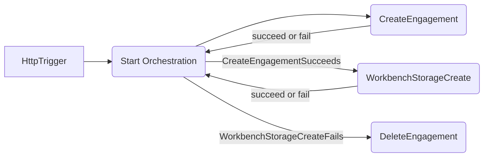

# Simple orchestration with Azure Durable Functions

> Note: Both csproj and sln files are provided, remove whichever is unnecessary for your environment

This repo contains the following:

- Simple HTTP trigger to kickoff an orchestration
- Simple orchestration function that handles two activities
  - EngagementActivity: responsible for creating and deleting engagements
  - WorkbenchStorageActivity: responsible for creating and deleting storage

