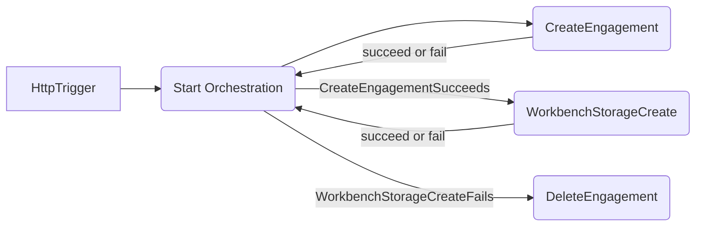

# Simple orchestration with Azure Durable Functions

> Note: Both csproj and sln files are provided, remove whichever is unnecessary for your environment

This repo contains the following:

- Simple HTTP trigger to kickoff an orchestration
- Simple orchestration function that handles two activities
  - EngagementActivity: responsible for creating and deleting engagements
  - WorkbenchStorageActivity: responsible for creating and deleting storage



## Deploy to Azure

```sh
RG_NAME='simple-orchestration'
LOCATION='eastus'
STORAGE_NAME='mysimplestore' # must be globally unique
FN_NAME='SimpleOrchestration'

az login
az group create -n $RG_NAME -l $LOCATION
az storage account create \
  --name $STORAGE_NAME \
  -l $LOCATION \
  -g $RG_NAME \
  --sku Standard_LRS \
  --allow-blob-public-access false

az functionapp create \
  --name $FN_NAME \
  -g $RG_NAME \
  --consumption-plan-location $LOCATION \
  --runtime dotnet-isolated \
  --functions-version 4  \
  --storage-account $STORAGE_NAME \
  --os-type Linux

func azure functionapp publish $FN_NAME
```
