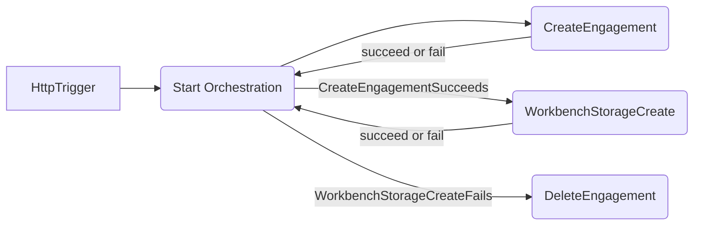

# Simple orchestration with Azure Durable Functions

This repo contains the following:

- Simple HTTP trigger to kickoff an orchestration
- Simple orchestration function that handles two activities
  - EngagementActivity: responsible for creating and deleting engagements
  - WorkbenchStorageActivity: responsible for creating and deleting storage



## Retry Options

This repo implements retry policies in a few different ways to demonstrate the verious options available:

- SimpleOrchestrator relies on retry capabilities built into the DurableTask framework. It uses the [Automatic retry](https://learn.microsoft.com/en-us/azure/azure-functions/durable/durable-functions-error-handling?tabs=csharp-isolated#automatic-retry-on-failure) but [custom handlers](https://learn.microsoft.com/en-us/azure/azure-functions/durable/durable-functions-error-handling?tabs=csharp-isolated#custom-retry-handlers) may be used instead. 
- The HTTP client for use within the EngagementActivity is configured to use [.NET HTTP resiliency extensions](https://www.nuget.org/packages/Microsoft.Extensions.Http.Resilience) to enable retries upon registration at startup.
- The WorkbenchActivity implements custom retry policies with [.NET resiliency](https://www.nuget.org/packages/Microsoft.Extensions.Resilience)

This is for demo purposes and users should be careful to avoid stacking retry policies.

## Develop and run locally

This repo comes equipped with a [VS Code Dev Container](https://code.visualstudio.com/docs/devcontainers/create-dev-container) additional methods to develop and run Azure Functions locally can be found in the [official docs](https://learn.microsoft.com/en-us/azure/azure-functions/functions-develop-local).

## Deploy to Azure

Assuming an existing Azure subscription exists and you have permissions to create the following resources:

```sh
RG_NAME='simple-orchestration'
LOCATION='eastus'
STORAGE_NAME='mysimplestore' # must be globally unique
FN_NAME='SimpleOrchestration' # must be globally unique

az login
az group create -n $RG_NAME -l $LOCATION
az storage account create \
  --name $STORAGE_NAME \
  -l $LOCATION \
  -g $RG_NAME \
  --sku Standard_LRS \
  --allow-blob-public-access false

az functionapp create \
  --name $FN_NAME \
  -g $RG_NAME \
  --consumption-plan-location $LOCATION \
  --runtime dotnet-isolated \
  --functions-version 4  \
  --storage-account $STORAGE_NAME \
  --os-type Linux

cd src
func azure functionapp publish $FN_NAME
```
